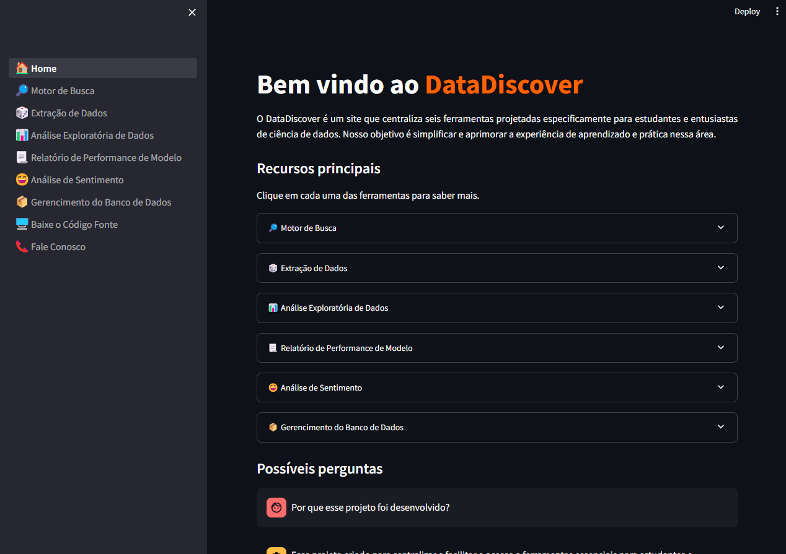

## 📅 **Projeto Integrador IV** – DataDiscover, uma ferramenta para potencializar o aprendizado de estudantes de ciência de dados.



Bem-vindo ao **DataDiscover**! Essa aplicação foi projetada especificamente
para estudantes e entusiastas de ciência de dados. Nosso objetivo é simplificar
e aprimorar a experiência de aprendizado e prática nessa área.

## 🚀 **Features**

### **🏠 Home**
A primeira tela, definida como “Home”, foi criada com o objetivo de ser o ponto de partida para utilização do Data Discover, nome dado a aplicação. É apresentado seu objetivo, recursos principais, possíveis perguntas e a documentação completa do projeto.

<details>
<summary>Análise gráfica da tela</summary>
  
https://github.com/user-attachments/assets/d0049b01-395b-4f43-b7d8-4b37ea7d8f96

</details>

### **🔎 Motor de Busca**
O motor de busca permite que você pesquise artigos acadêmicos no Google Scholar, oferecendo também uma visão analítica dos principais autores e sites relevantes. É ideal para quem precisa explorar rapidamente as principais publicações em um campo específico.

<details>
<summary>Análise gráfica da tela</summary>

https://github.com/user-attachments/assets/0ce2c26d-20c6-48b8-9b90-72a28c474be8

</details>

### **🎲 Extração de Dados**
Nesta tela, você pode pesquisar e baixar conjuntos de dados diretamente do Kaggle em formatos CSV e XLSX. A interface facilita o acesso rápido a uma variedade de dados para análise ou treinamento de modelos.

<details>
<summary>Análise gráfica da tela</summary>

https://github.com/user-attachments/assets/f7e18ae0-c2a2-40b9-b9f6-3046af2f02dd

</details>
  
### **📊 Análise Exploratória de Dados**
Esta tela oferece uma análise geral e estatística detalhada dos dados em um conjunto selecionado, permitindo ao usuário entender melhor as características e tendências antes de qualquer modelagem.

<details>
<summary>Análise gráfica da tela</summary>

https://github.com/user-attachments/assets/e25178d1-9b10-4ed2-9b46-81d38d42d56b

</details>

### **📃 Relatório de Performance de Modelo**
Aqui, você pode comparar diferentes modelos de aprendizado de máquina para determinar qual terá o melhor desempenho com o seu conjunto de dados, facilitando a escolha do modelo mais eficaz.

<details>
<summary>Análise gráfica da tela</summary>

https://github.com/user-attachments/assets/972ff146-6a53-4506-9a22-8bad30b1a3d8

</details>

### **😄 Análise de Sentimento**
Nesta tela, você pode carregar uma base de dados e selecionar uma coluna para realizar a classificação de sentimentos (positivo, negativo ou neutro), obtendo insights sobre a opinião expressa nos textos.

<details>
<summary>Análise gráfica da tela</summary>

https://github.com/user-attachments/assets/a55a4268-7869-48a1-87f7-ed1a6d88beae

</details>

### **📦 Gerencimento do Banco de Dados**
Esta tela permite visualizar e gerencie todas as bases de dados armazenadas em um banco de dados não relacional, incluindo a opção de excluir conjuntos de dados desnecessários.

<details>
<summary>Análise gráfica da tela</summary>

https://github.com/user-attachments/assets/8016ea3a-8e7a-447a-9d30-46ac382ad773

</details>

### **🖥️ Baixe o Código Fonte**
Prezando pelo aprimoramento contínuo da ferramenta, foi elaborada uma página que contém as instruções de como realizar o download do código-fonte da aplicação.

<details>
<summary>Análise gráfica da tela</summary>


</details>

### **📞 Fale Conosco**
A ferramenta foi projetada para ser transparente e de código aberto, o que incentiva a colaboração e seu aperfeiçoamento constante. Desta maneira, a página seguinte nomeada “Fale Conosco” é a porta de entrada para que atualizações sejam sugeridas.

<details>
<summary>Análise gráfica da tela</summary>


</details>

## 🛠️ **Tech Stack**

- **Frontend:** Streamlit
- **Backend:** Python
- **Database:** MongoDB

## 📂 **Estrutura do Projeto**

```bash
├── /images            		# Imagens do projeto
├── /pages					# Telas da aplicação
│   ├── 1_🔎_Motor de Busca.py  
│   ├── 2_🎲_Extração de Dados.py
│   ├── 3_📊_Análise Exploratória de Dados.py
│   ├── 4_📃_Relatório de Performance de Modelo.py
│   ├── 5_😄_Análise de Sentimento.py
│   ├── 6_📦_Gerencimento do Banco de Dados.py
│   ├── 7_🖥️_Baixe o Código Fonte.py
│   ├── 8_📞_Fale Conosco.py
├── .gitignore				# Ignora os arquivos para o github
├── 0_🏠_Home.py			# Homepage da aplicação e chamada para as telas
├── corrige-requirements.md	# Documentação de correção de possíveis erros
├── requiremets.txt			# Dependências do projeto
└── README.md				# Documentação geral do projeto
```
